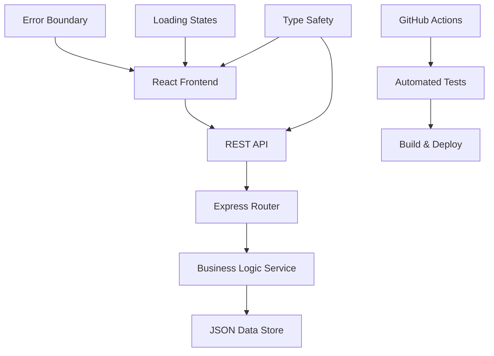

# Headless CMS Microservice Demo

[](https://github.com/stevenbode/headless-cms-microservice-demo/actions/workflows/ci.yml)
[](https://opensource.org/licenses/MIT)
[](https://nodejs.org/)
[](https://reactjs.org/)
[](https://www.typescriptlang.org/)

> **Ein vollständiges Demo-Projekt für moderne Content-Architektur**  
> Demonstriert API-First Development und Microservice-Prinzipien mit React Frontend und Node.js Backend.

---

## Inhaltsverzeichnis

- [Projektübersicht](#projektübersicht)
- [Features](#features)
- [Technologie-Stack](#technologie-stack)
- [Architektur](#architektur)
- [Installation & Setup](#installation--setup)
- [API-Dokumentation](#api-dokumentation)
- [Tests & Qualitätssicherung](#tests--qualitätssicherung)
- [Entwicklung](#entwicklung)
- [Deployment](#deployment)
- [Screenshots](#screenshots)
- [Contributing](#contributing)
- [Lizenz](#lizenz)

---

## Projektübersicht

Dieses Repository demonstriert ein **Headless CMS-System** mit modernen Entwicklungsansätzen:

### **Was ist ein Headless CMS?**
Ein Headless CMS trennt die Content-Verwaltung vom Frontend und stellt Inhalte über APIs bereit. Dies ermöglicht:
- **Flexibilität**: Jede Frontend-Technologie kann verwendet werden
- **Skalierbarkeit**: Frontend und Backend können unabhängig skaliert werden
- **Multi-Channel**: Derselbe Content für Web, Mobile, IoT, etc.

### **Warum dieses Projekt?**
- **Lernressource**: Beispiel für Best Practices
- **Starter Template**: Basis für eigene Projekte
- **Production-Ready**: Vollständiges CI/CD-Setup

---

## Features

### **Backend (Node.js/Express)**
- RESTful API mit Express und TypeScript
- JSON-basierte Datenhaltung (einfach für Demo-Zwecke)
- Fehlerbehandlung & Logging mit strukturierten Responses
- CORS & Security Headers für sichere API-Kommunikation
- Health Check Endpoint für Monitoring
- Pagination & Filterung für effiziente Datenabfrage
- Volltext-Suche in Posts
- Tag-basierte Filterung

### **Frontend (React)**
- React 18 + TypeScript für typsichere Entwicklung
- React Router für Client-Side Routing
- Responsive Design mit CSS Custom Properties
- Error Boundaries für robuste User Experience
- Loading States und Progress-Indikatoren
- Search & Filter UI mit Live-Updates
- Pagination mit intelligenter Seitennavigation
- Dark Mode Support (systembasiert)

### **DevOps & Qualität**
- GitHub Actions CI/CD für automatisierte Tests
- ESLint + TypeScript für Code-Qualität
- Security Audits für Dependencies
- Multi-Node.js-Version Testing (18.x, 20.x)
- Integration Tests für End-to-End-Validierung

---

## Technologie-Stack

### **Backend**
| Technologie | Version | Zweck |
|-------------|---------|-------|
| **Node.js** | 18+ | JavaScript Runtime |
| **Express** | 4.18+ | Web Framework |
| **TypeScript** | 5.3+ | Typsicherheit |
| **Cors** | 2.8+ | Cross-Origin Requests |
| **Helmet** | 7.1+ | Security Headers |
| **Compression** | 1.7+ | Response Compression |

### **Frontend**
| Technologie | Version | Zweck |
|-------------|---------|-------|
| **React** | 18.2+ | UI Library |
| **TypeScript** | 5.2+ | Type Safety |
| **Vite** | 5.0+ | Build Tool |
| **React Router** | 6.20+ | Client Routing |
| **Axios** | 1.6+ | HTTP Client |

### **Development & CI/CD**
| Tool | Zweck |
|------|-------|
| **GitHub Actions** | Continuous Integration |
| **ESLint** | Code Linting |
| **Prettier** | Code Formatting |
| **Nodemon** | Development Server |
| **Concurrently** | Parallel Script Execution |

---

## Architektur

```
headless-cms-microservice-demo/
├── backend/                    # Node.js API Server
│   ├── src/
│   │   ├── routes/             # API Route Handlers
│   │   ├── services/           # Business Logic
│   │   ├── types/              # TypeScript Interfaces
│   │   ├── middleware/         # Express Middleware
│   │   └── index.ts            # Server Entry Point
│   ├── content/                # JSON Data Source
│   │   └── posts.json          # Blog Posts Data
│   └── package.json
│
├── frontend/                   # React SPA
│   ├── src/
│   │   ├── components/         # React Components
│   │   ├── services/           # API Communication
│   │   ├── types/              # TypeScript Interfaces
│   │   ├── App.tsx             # Main App Component
│   │   └── main.tsx            # React Entry Point
│   ├── index.html              # HTML Template
│   └── package.json
│
├── .github/workflows/          # GitHub Actions
│   └── ci.yml                  # CI/CD Pipeline
│
├── package.json                # Root Package Config
└── README.md                   # Project Documentation
```

### **API-First Architecture**



---

## Installation & Setup

### **Voraussetzungen**
- **Node.js** 18+ ([Download](https://nodejs.org/))
- **npm** 9+ (mit Node.js enthalten)
- **Git** ([Download](https://git-scm.com/))

### **1. Repository klonen**
```bash
git clone https://github.com/stevenbode/headless-cms-microservice-demo.git
cd headless-cms-microservice-demo
```

### **2. Dependencies installieren**
```bash
# Alle Dependencies (Root, Backend, Frontend)
npm run install:all

# Oder einzeln:
npm install                    # Root dependencies
cd backend && npm install      # Backend dependencies
cd frontend && npm install     # Frontend dependencies
```

### **3. Entwicklungsserver starten**
```bash
# Beide Server parallel starten (empfohlen)
npm run dev

# Oder einzeln:
npm run dev:backend     # Backend auf http://localhost:3001
npm run dev:frontend    # Frontend auf http://localhost:5173
```

### **4. Anwendung öffnen**
- **Frontend**: http://localhost:5173
- **Backend API**: http://localhost:3001
- **Health Check**: http://localhost:3001/health

---

## API-Dokumentation

### **Base URL**
```
http://localhost:3001
```

### **Endpoints**

#### **Health Check**
```http
GET /health
```
**Response:**
```json
{
  "status": "healthy",
  "timestamp": "2024-01-15T10:00:00.000Z",
  "service": "headless-cms-backend",
  "version": "1.0.0"
}
```

#### **Alle Posts abrufen**
```http
GET /api/posts?page=1&limit=10&search=api&tag=react&author=steven
```

**Query Parameters:**
| Parameter | Type | Default | Beschreibung |
|-----------|------|---------|--------------|
| `page` | number | 1 | Seite für Pagination |
| `limit` | number | 10 | Posts pro Seite (max. 50) |
| `search` | string | - | Volltext-Suche |
| `tag` | string | - | Filter nach Tag |
| `author` | string | - | Filter nach Autor |

**Response:**
```json
{
  "success": true,
  "data": [
    {
      "id": "1",
      "title": "API-First Development",
      "excerpt": "Warum API-First die Zukunft ist...",
      "content": "Vollständiger Artikel-Text...",
      "author": "Steven Bode",
      "publishedAt": "2024-01-15T10:00:00Z",
      "updatedAt": "2024-01-15T10:00:00Z",
      "tags": ["API", "Development"],
      "imageUrl": "https://example.com/image.jpg",
      "readTime": 5
    }
  ],
  "pagination": {
    "currentPage": 1,
    "totalPages": 3,
    "totalPosts": 25,
    "hasNext": true,
    "hasPrev": false
  }
}
```

#### **Einzelnen Post abrufen**
```http
GET /api/posts/:id
```

**Response:**
```json
{
  "success": true,
  "data": {
    "id": "1",
    "title": "API-First Development",
    // ... vollständige Post-Daten
  }
}
```

#### **Posts nach Tag**
```http
GET /api/posts/tag/:tag
```

---

## Tests & Qualitätssicherung

### **Lokale Tests ausführen**
```bash
# Alle Tests
npm test

# Backend Tests
cd backend && npm test

# Frontend Tests
cd frontend && npm test

# Linting
npm run lint
```

### **GitHub Actions Pipeline**

Die CI/CD-Pipeline führt automatisch aus:

1. **Code-Qualität**
   - ESLint für beide Projekte
   - TypeScript-Kompilierung
   - Dependency-Audit

2. **Tests**
   - Unit Tests (Backend/Frontend)
   - Integration Tests
   - Health Check Tests

3. **Build**
   - Production Builds
   - Artifact-Upload
   - Multi-Node.js-Version Testing

4. **Deployment Check**
   - Bereitschaftsprüfung
   - Artifact-Validierung

---

## Entwicklung

### **Entwicklungs-Workflow**
```bash
# 1. Feature Branch erstellen
git checkout -b feature/neue-funktionalität

# 2. Entwickeln...
npm run dev

# 3. Code-Qualität prüfen
npm run lint
npm test

# 4. Commit & Push
git add .
git commit -m "feat: neue Funktionalität hinzugefügt"
git push origin feature/neue-funktionalität
```

### **Code-Style Guidelines**
- **TypeScript**: Strikte Typisierung aktiviert
- **ESLint**: Airbnb Config mit Custom Rules
- **Naming**: camelCase für Variablen, PascalCase für Komponenten
- **Comments**: JSDoc für öffentliche APIs

### **Ordner-Struktur erweitern**
```bash
# Backend
backend/src/
├── controllers/     # Request Handler
├── models/         # Data Models
├── utils/          # Utility Functions
├── config/         # Configuration
└── tests/          # Test Files

# Frontend
frontend/src/
├── hooks/          # Custom React Hooks
├── utils/          # Utility Functions
├── styles/         # Global Styles
├── assets/         # Static Assets
└── __tests__/      # Test Files
```

---

## Deployment

### **Build für Production**
```bash
# Alle Projekte bauen
npm run build

# Einzeln
npm run build:backend
npm run build:frontend
```

### **Production Server starten**
```bash
# Backend (nach Build)
cd backend && npm start

# Frontend (statische Dateien)
cd frontend && npm run preview
```

### **Docker Deployment** (optional)
```dockerfile
# Beispiel Dockerfile für Backend
FROM node:18-alpine
WORKDIR /app
COPY package*.json ./
RUN npm ci --only=production
COPY dist/ ./dist/
COPY content/ ./content/
EXPOSE 3001
CMD ["npm", "start"]
```

### **Environment Variables**
```bash
# Backend (.env)
PORT=3001
NODE_ENV=production
FRONTEND_URL=https://your-domain.com

# Frontend (.env)
VITE_API_BASE_URL=https://api.your-domain.com
```

---

## Screenshots

### **Homepage mit Blog Posts**


*Responsive Grid-Layout mit modernem Design*

### **Post-Detail-Ansicht**


*Vollständige Artikel-Ansicht mit Syntax-Highlighting*

### **Search & Filter Interface**


*Erweiterte Suche mit Live-Updates*

### **API Explorer**


*Interaktive API-Dokumentation*

---

## Contributing

Beiträge sind willkommen! Bitte folgen Sie diesen Schritten:

1. **Fork** das Repository
2. **Branch** erstellen (`git checkout -b feature/amazing-feature`)
3. **Commit** Ihre Änderungen (`git commit -m 'feat: add amazing feature'`)
4. **Push** zum Branch (`git push origin feature/amazing-feature`)
5. **Pull Request** öffnen

### **Commit Conventions**
Wir verwenden [Conventional Commits](https://www.conventionalcommits.org/):
- `feat:` Neue Features
- `fix:` Bug-Fixes
- `docs:` Dokumentation
- `style:` Code-Formatierung
- `refactor:` Code-Refactoring
- `test:` Tests hinzufügen
- `chore:` Maintenance-Tasks

---

## Lizenz

Dieses Projekt steht unter der **MIT-Lizenz** - siehe [LICENSE](LICENSE) für Details.

```
MIT License

Copyright (c) 2024 Steven Bode

Permission is hereby granted, free of charge, to any person obtaining a copy
of this software and associated documentation files (the "Software"), to deal
in the Software without restriction, including without limitation the rights
to use, copy, modify, merge, publish, distribute, sublicense, and/or sell
copies of the Software, and to permit persons to whom the Software is
furnished to do so, subject to the following conditions:

The above copyright notice and this permission notice shall be included in all
copies or substantial portions of the Software.
```

---

## Über den Entwickler

**Steven Bode**  
- GitHub: [https://github.com/steven-bode](https://github.com/steven-bode)
- LinkedIn: [https://www.linkedin.com/in/steven-timothy-bode](https://www.linkedin.com/in/steven-timothy-bode-998b2218b/)
- E-Mail: [mailsteven-bo.de](mailto:mailsteven-bo.de)

> *Erstellt als Showcase-Projekt für Bewerbungszwecke*  
> *Demonstriert moderne Webentwicklung mit TypeScript, React und Node.js*

---

## Danksagungen

- **React Team** für das großartige Framework
- **Node.js Community** für die robusten Tools
- **TypeScript Team** für typsichere Entwicklung
- **Open Source Community** für die unzähligen Libraries

---

<div align="center">

**Wenn Ihnen dieses Projekt gefällt, geben Sie ihm einen Stern!**

[Zurück zum Anfang](#headless-cms-microservice-demo)

</div> 